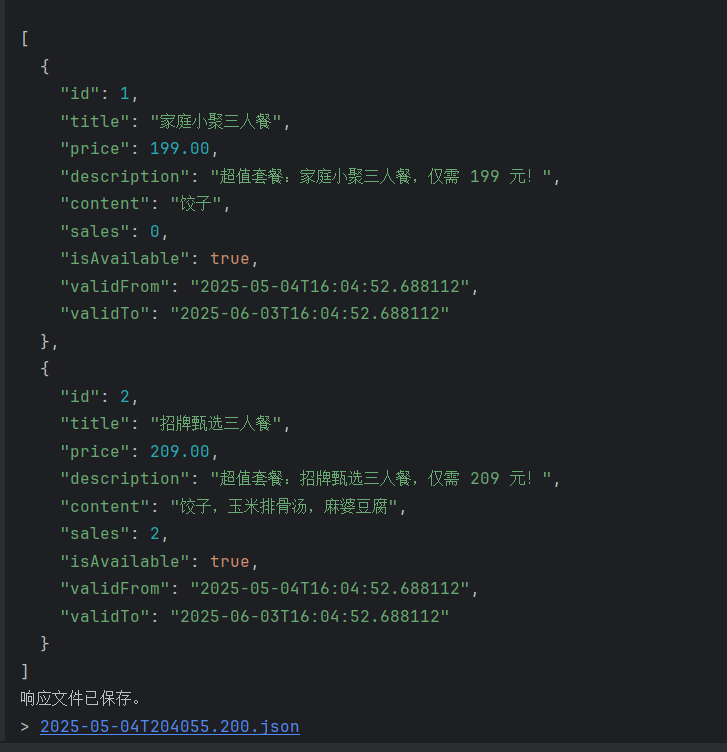
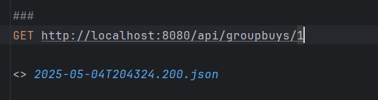
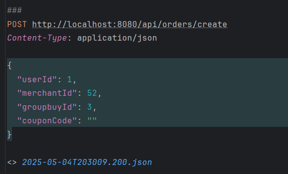
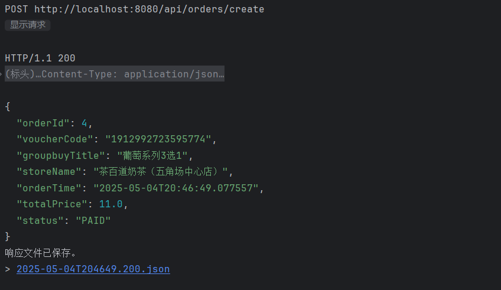
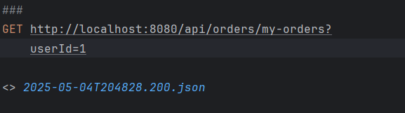
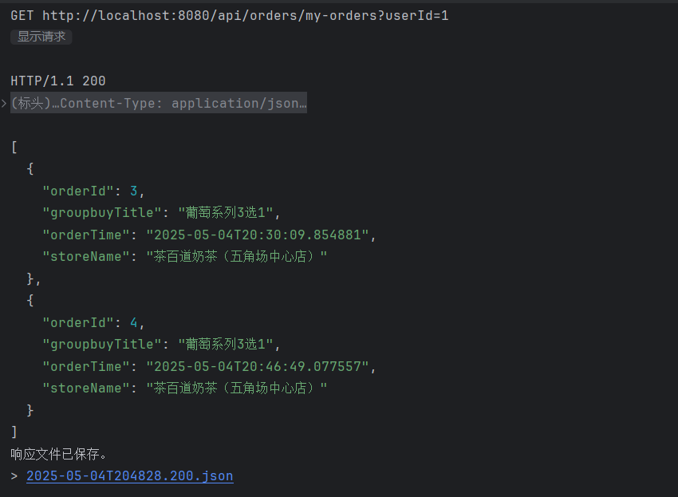
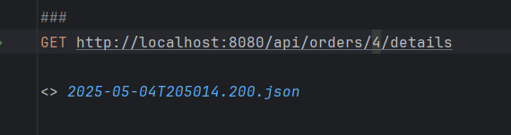
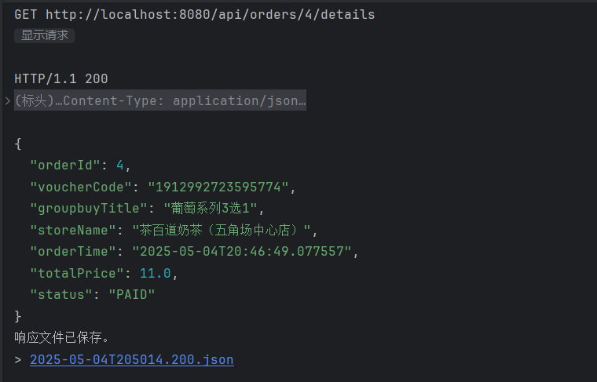

# lab3_backend

### GroubuyController
1. 通过商家ID 查询团购
- 51可替换成具体的商家ID

- 返回结果

2. 通过团购ID 查询具体的团购信息
- 1 可替换成具体的团购ID

- 返回结果

### OrderController
1. 创建订单
- 请求参数，需要用户ID，商家ID，团购ID以及优惠券ID（可选）

- 返回结果，这里没有返回具体的二维码，只是16位券码，需要前端根据券码去生成二维码

2.查询用户的所有历史订单
- 通过用户ID查询，这里1可以替换成具体的用户ID

- 返回结果

3.通过订单ID查询具体的订单信息
- 这里的4可以替换成具体的订单ID

- 返回结果

### CouponController

